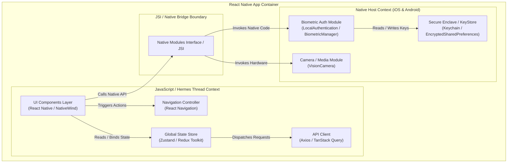

# C4 Diagrams (React Native Context)

## Overview

Use C4 diagrams to clarify React Native app architecture before detailed implementation. Focus on system boundaries, runtime thread separation (JS Thread vs. Native Thread), state management, native modules (JSI/Bridge), and external backend integrations. Draw only the levels that add immediate architectural value.

---

## React Native C4 Level Mapping

| C4 Level           | React Native Scope                     | What to Include                                                                                                                                               |
| :----------------- | :------------------------------------- | :------------------------------------------------------------------------------------------------------------------------------------------------------------ |
| **System Context** | High-level system ecosystem            | Mobile User, RN Mobile App, Backend APIs, Third-Party BaaS (Firebase, Supabase), Push Gateways (APNs/FCM).                                                    |
| **Container**      | Executable & deployable units          | iOS Native App (`.ipa`), Android Native App (`.apk`/`.aab`), Backend Web API, Local Storage (SQLite/MMKV), Remote Database.                                   |
| **Component**      | Internal parts of the RN App container | JS Engine (Hermes), State Manager (Zustand/Redux), Navigation Stack, UI Layer (NativeWind/Reanimated), Native Modules (Camera, Biometrics, JSI bindings).     |
| **Dynamic**        | Sequence of runtime execution          | Cross-thread interactions (JS Thread $\rightarrow$ JSI Bridge $\rightarrow$ Native Main Thread $\rightarrow$ Remote API $\rightarrow$ Callback/Store Update). |
| **Deployment**     | Build & Distribution pipelines         | TestFlight, Google Play Console, OTA CodePush/Expo Updates, CI/CD runners (EAS, Fastlane, GitHub Actions).                                                    |

---

## First Gates

Before diagramming, clarify these architectural choices:

| Choice       | Options                                           | Default Behavior                                                                                                               |
| :----------- | :------------------------------------------------ | :----------------------------------------------------------------------------------------------------------------------------- |
| **Purpose**  | Codebase mapping, feature design, boundary review | Inspect existing entry points (`App.tsx`, native bridges) for existing code; call out assumptions for new features.            |
| **Format**   | Plain Mermaid, ASCII                              | Default to plain Mermaid syntax (`flowchart` or `sequenceDiagram`). Avoid C4-specific Mermaid syntax for parser compatibility. |
| **Boundary** | Client-only, Client-to-Backend, Native-Bridge     | Default to Client-to-Backend for feature flows; default to Client-only for complex local UI/Native UI modules.                 |

---

## Output Rules

- **Syntax Compatibility**: Mermaid diagrams must use standard `flowchart TD/LR` or `sequenceDiagram` syntax.
- **Thread & Runtime Boundaries**: Clearly distinguish between components running in the **JavaScript Context** and those running in the **Native Host Context (Swift/Kotlin/C++)**.
- **Concise Scope**: Avoid drawing all 4 levels at once. Start with a Container or Component diagram depending on the problem.
- **Explications**: Accompany every diagram with 3–5 bullet points highlighting key data flows, thread boundaries, assumptions, and unresolved architectural risks.

---

## React Native Templates

### 1. Container Diagram (App Ecosystem)

Use to visualize how state, navigation, native modules, and the JS runtime interact inside the mobile app.



### 2. Dynamic Diagram (Native Hardware Execution Sequence)

Use to illustrate dynamic request/event flows spanning the JS Thread, Native Hardware, and Backend Services.

```
sequenceDiagram
    autonumber
    actor User as Mobile User
    participant UI as React Native UI (JS Thread)
    participant Store as State Store (Zustand)
    participant JSI as JSI / Native Bridge
    participant Native as Native Module (iOS/Android)
    participant API as Remote Backend API

    User->>UI: Taps "Authenticate with FaceID"
    UI->>Store: Set Auth Status to "Pending"
    UI->>JSI: Call native prompt BiometricAuth.authenticate()
    JSI->>Native: Invoke OS System Biometric Prompt
    Native-->>User: Display FaceID / Fingerprint System UI
    User-->>Native: Provides Biometric Sample
    Native-->>JSI: Return Security Token
    JSI-->>UI: Resolve Promise with Auth Token
    UI->>API: POST /auth/verify-token (Token Payload)
    API-->>UI: 200 OK (Session JWT)
    UI->>Store: Update Auth Status to "Authenticated"
    Store-->>UI: Re-render UI with Dashboard Screen
```

## Common Mistakes

| Mistake                            | Fix                                                                                                               |
| :--------------------------------- | :---------------------------------------------------------------------------------------------------------------- |
| **Ignoring Thread Boundaries**     | Explicitly show whether a module runs in the JS thread context or Native OS host context.                         |
| **Mixing Native & Web Constructs** | Treat the React Native bundle as a compiled native application container, not a standard web browser.             |
| **Treating Modules as Containers** | Store files, custom hooks, and navigation stacks are Components inside the single React Native App Container.     |
| **C4 Syntax Fragility**            | Use standard plain Mermaid syntax (flowchart, sequenceDiagram) to ensure universal markdown parser compatibility. |
